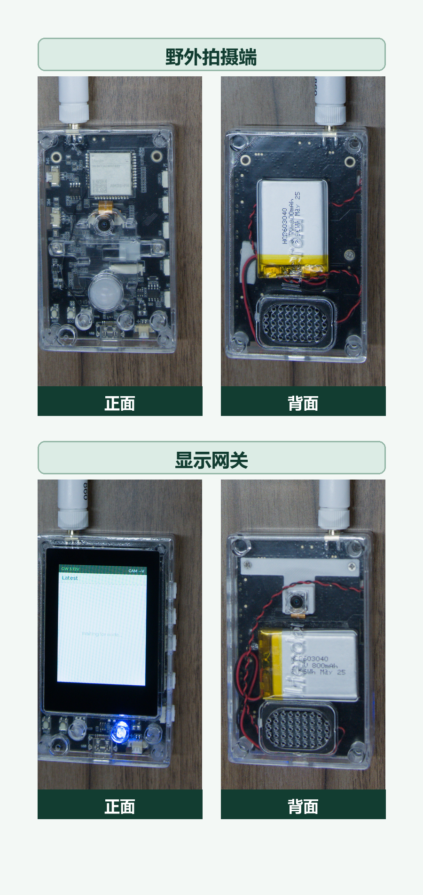
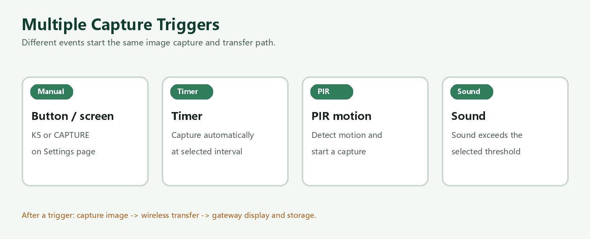

# AM36-WildCam

语言：中文 | [English](README_EN.md)

AM36-WildCam 是一个基于利尔达 AM36 ESP32-S3 与 LR2021 平台的开源远距离无线图像传输演示项目。同一份固件既可以作为野外拍摄端，也可以作为手持显示网关使用。

拍摄端集成摄像头、PIR 人体感应器、麦克风和 LR2021 无线芯片；网关提供 LCD、触摸操作、实体按键、链路信息和 HTTP 图片库。拍摄端可安装在树木、围栏、农场、林地、设备外壳或室外入口等位置，并通过远程命令或自动触发方式拍摄。



## 目录

- [主要功能](#主要功能)
- [硬件平台与设备角色](#硬件平台与设备角色)
- [外购配件与 PIR 接线](#外购配件与-pir-接线)
- [说明文档](#说明文档)
- [开发要求](#开发要求)
- [编译与烧录](#使用-vs-code-编译与烧录)
- [按键与角色切换](#按键与角色切换)
- [触摸操作](#触摸操作)
- [基本使用](#基本使用)
- [演示网络安全说明](#演示网络安全说明)
- [3D 打印结构件](#3d-打印结构件)
- [仓库结构](#仓库结构)
- [许可证](#许可证)

## 主要功能

- 通过网关手动发起远程拍照。
- 拍摄端支持定时、PIR 感应和声音触发拍照。
- 使用 LR2021 FLRC 传输图像，并支持丢包检测和重传。
- 低功耗模式下使用 LoRa 长前导码唤醒，再进入 FLRC 传输。
- 可选拍摄前录音和本地语音告警。
- 网关 LCD 提供图片、设置、接收进度和链路状态页面。
- 支持触摸点击以及左右滑动操作。
- HTTP 图片库可查看和下载已接收的图片与音频。
- 同一份固件支持持久化保存网关/拍摄端角色。



## 硬件平台与设备角色

本项目使用 **利尔达 L-LRMAM36-FANN4-DK01 开发套件**。网关和拍摄端各使用一套相同的开发套件和固件，AM312 PIR 感应模块需要单独外购。

<p align="center">
  <a href="https://item.taobao.com/item.htm?id=1074290287510"></a><br>
  <sub>利尔达 L-LRMAM36-FANN4-DK01 开发套件（点击图片打开购买页面）</sub>
</p>

| 角色 | 套件与外购件 | 用途 |
| --- | --- | --- |
| 野外拍摄端 | [利尔达 L-LRMAM36-FANN4-DK01 开发套件](https://item.taobao.com/item.htm?id=1074290287510)（https://item.taobao.com/item.htm?id=1074290287510） + [AM312 PIR 感应模块](https://e.tb.cn/h.8QmQiC5bW3w6Jr4?tk=MG18TXmjFKS)（https://e.tb.cn/h.8QmQiC5bW3w6Jr4?tk=MG18TXmjFKS） | 拍摄图片和可选音频，并将结果传输到网关。 |
| 显示网关 | [利尔达 L-LRMAM36-FANN4-DK01 开发套件](https://item.taobao.com/item.htm?id=1074290287510)（https://item.taobao.com/item.htm?id=1074290287510） | 控制拍摄端，接收并显示图片，查看链路状态，并提供 HTTP 图片库。 |

除单独外购的 AM312 PIR 感应模块外，项目所需的其他硬件均由 DK01 开发套件提供，不再拆分列出。购买链接来自硬件厂商提供的淘宝商品入口；库存、套装内容、价格和商品信息以销售页面为准。

## 外购配件与 PIR 接线

野外拍摄端的 PIR 人体感应功能需要外接一个 AM312 微型热释电红外感应模块。

| 外购配件 | 用途 | 购买链接 |
| --- | --- | --- |
| AM312 微型人体红外感应模块 | 检测人体或动物移动产生的红外变化，并触发拍摄端拍照 | [淘宝：微型 AM312 人体红外线感应模块](https://e.tb.cn/h.8QmQiC5bW3w6Jr4?tk=MG18TXmjFKS)（https://e.tb.cn/h.8QmQiC5bW3w6Jr4?tk=MG18TXmjFKS） |

请断电后接线，并优先使用开发板的 3.3 V 电源：

| AM312 引脚 | 连接到 L-LRMAM36-FANN4-DK01 | 说明 |
| --- | --- | --- |
| `VCC` | `3V3` | 建议使用 3.3 V 供电，避免把高于 3.3 V 的信号送入 ESP32-S3。 |
| `OUT` | `GPIO12` | 固件配置为输入下拉和高电平触发。 |
| `GND` | `GND` | AM312 与开发板必须共地。 |

PIR 仅用于**拍摄端模式**。`GPIO12` 在网关模式下同时用于触摸屏中断，因此不要在网关模式下让 AM312 与触摸中断共用该引脚。接线排针或焊盘位置请以 DK01 板卡丝印和硬件资料为准。

AM312 是被动式红外传感器，它检测视野内红外辐射的变化，而不是持续判断是否“有人”。应让目标尽量横向穿过传感器视野，并避免镜头正对阳光、热风口或快速变化的热源。常见 AM312 模块的典型探测距离约为 3–5 米、视场角不超过约 100°，实际效果会受到安装高度、环境温度、外壳窗口和目标移动方向影响。

固件启动约 5 秒后才对 `GPIO12` 进行布防。AM312 输出高电平时立即产生 PIR 事件；触发后固件等待 15 秒再重新布防，PIR 与声音触发共用拍摄冷却时间。在低功耗模式下，高电平还可以唤醒拍摄端并启动拍照上传。使用前需要在网关设置页开启 `PIR Motion`，该配置会发送到拍摄端并保存在 NVS 中。

## 说明文档

- [中文功能说明](docs/guides/AM36_WildCam_Feature_Guide_ZH.pdf)
- [英文功能说明](docs/guides/AM36_WildCam_Feature_Guide.pdf)
- [DK01 开发套件原理图](docs/hardware/schematic/L-LRMAM36-FANN4-DK01_SCH.pdf)
- [DK01 开发套件 PCB 源文件](docs/hardware/pcb/L-LRMAM36-FANN4-DK01_PCB.PcbDoc)
- [3D 打印结构件目录](docs/3d-print/README.md)——提供 7 个 STEP 结构模型文件。

## 开发要求

- 建议准备两套利尔达 L-LRMAM36-FANN4-DK01 开发套件，分别作为网关和拍摄端。
- 如需人体/动物移动触发，准备一个外接 AM312 PIR 模块。
- USB 数据线及所需的 USB 转串口驱动。
- 必须使用 [ESP-IDF](https://github.com/espressif/esp-idf) v5.5.3。
- 安装 ESP-IDF 安装程序提供的 Python 和编译工具。
- 首次解析 ESP-IDF Component Manager 依赖时需要访问网络。

项目目标芯片为 `esp32s3`，使用 8 MB Flash 和自定义分区表 `partitions.csv`。组件清单当前从 Espressif staging registry 获取 `lierda-iot/esp_lora_driver` `0.0.7`。

## 使用 VS Code 编译与烧录

1. 克隆仓库并使用 Visual Studio Code 打开仓库根目录。
2. 在 VS Code 扩展市场安装 Espressif 官方 ESP-IDF 扩展。
3. 在扩展提示时选择已安装的 ESP-IDF v5.5.3 环境。本机安装路径不会写入仓库。
4. 点击状态栏中的 ESP-IDF **Build** 图标。
5. 连接开发板，在 ESP-IDF 状态栏选择串口，然后点击 **Flash**；使用 **Monitor** 查看串口输出。

ESP-IDF 工程配置由仓库中的 CMake、`sdkconfig` 和 `sdkconfig.defaults` 提供；本机 VS Code 路径和串口设置不纳入仓库。

## 使用终端编译与烧录

在项目目录中打开 ESP-IDF v5.5.3 终端。

仓库中的 `sdkconfig.defaults` 会在重新生成 `sdkconfig` 时保留 ESP32-S3 目标、240 MHz CPU、8 MB DIO Flash、自定义分区表、Octal PSRAM 和面向发布的编译优化配置。

```console
idf.py set-target esp32s3
idf.py build
```

烧录固件并打开串口监视器。请将 `COMx` 替换为开发板实际串口号。

```console
idf.py -p COMx flash monitor
```

按 `Ctrl+]` 退出监视器，然后对第二块开发板重复烧录。两块板使用相同固件，并在设备上选择各自角色。

如果项目曾使用其他 ESP-IDF 版本或目标芯片进行配置，请先清理生成配置再重新编译：

```console
idf.py fullclean
idf.py set-target esp32s3
idf.py build
```

## 按键与角色切换

开发板上的实体按键从上到下标为 `K1` 至 `K5`。设备角色保存在 NVS 中，重启后继续生效。

| 当前角色 | 操作 | 功能 |
| --- | --- | --- |
| 网关 | 短按 `K1` | 打开图片页面。 |
| 网关 | 长按 `K1` 至少 1.5 秒后松开 | 保存拍摄端角色，并重启进入野外拍摄端模式。 |
| 网关 | 短按 `K2` | 打开设置页面。 |
| 网关（电池供电） | 长按 `K3` | 开启或关闭设备电源。 |
| 网关 | 按 `K4` | 打开 FLRC 链路状态页面。 |
| 网关 | 按 `K5` | 立即发起远程拍照。 |
| 拍摄端 | 短按 `K2` | 保存网关角色，并重启进入显示网关模式。 |
| 拍摄端（电池供电） | 长按 `K3` | 开启或关闭设备电源。 |

未保存过角色的开发板默认以拍摄端模式启动。准备两台设备时，可让一块板保持拍摄端模式，在另一块板上短按 `K2` 将其切换为网关。

## 触摸操作

显示网关支持独立的触摸操作：

| 操作 | 功能 |
| --- | --- |
| 点击控件 | 执行屏幕上显示的操作。 |
| 左右滑动 | 在支持的页面或可滑动控件之间导航。 |

## 基本使用

1. 将同一份固件烧录到两套 AM36 开发套件。
2. 将其中一块配置为显示网关，另一块保持为野外拍摄端。
3. 将拍摄端安装在观察位置并将摄像头对准目标；如果需要使用 PIR 或声音触发，请确保感应器和麦克风没有被遮挡。
4. 让网关保持在 LR2021 无线通信范围内，通过设置页面配置 PIR、声音、定时、录音、语音告警、频率和低功耗行为。
5. 点击屏幕上的 `CAPTURE` 控件或按网关 `K5` 发起手动拍照；拍摄端完成拍摄后通过 FLRC 返回图片。
6. 按网关 `K4` 打开链路状态，短按 `K2` 打开设置，短按 `K1` 打开图片页面；使用电池供电时，长按 `K3` 可开关设备电源。
7. 可直接点击屏幕控件，并在支持页面导航的位置左右滑动。
8. 在网关上查看接收图片、RSSI、传输速率、丢包率和传输时间。
9. 如需浏览已保存结果，请使用手机或电脑连接网关设置页面显示的 Wi-Fi，并访问 `http://192.168.4.1`。

### 演示网络安全说明

SoftAP 当前有意配置为开放网络（`WIFI_AUTH_OPEN`），配置页、图库和图片接口不需要认证。本设计仅适用于受控演示或现场环境，不适合直接用于生产部署。正式使用前，应配置 WPA2/WPA3 密码，并为 HTTP 接口增加身份认证和访问授权。

无人值守时可启用定时、PIR 或声音触发。低功耗模式下，拍摄端可长期部署在远程观察位置；只有 PIR 触发或网关发送 LoRa 唤醒后，才会启动所需的 FLRC 传输流程。

## 3D 打印结构件

[`docs/3d-print/`](docs/3d-print/) 目录提供 7 个 STEP 结构模型文件，用于 AM36-WildCam 的外壳、安装支架及其他结构件。

## 仓库结构

```text
AM36-WildCam/
|-- main/                              应用、BSP、摄像头、无线、UI、音频和 Web 代码
|-- docs/images/                       README 使用的图片
|-- docs/guides/                       中英文功能说明
|-- docs/3d-print/                     3D 打印结构件预留目录
|-- docs/hardware/schematic/           DK01 开发套件原理图
|-- docs/hardware/pcb/                 DK01 开发套件 PCB 源文件
|-- CMakeLists.txt                     ESP-IDF 项目入口
|-- README.MD                          中文 README（默认）
|-- README_EN.md                       英文 README
|-- version.txt                        固件版本唯一来源
|-- CHANGELOG.md                       版本历史
|-- sdkconfig.defaults                 可复现的默认配置
|-- sdkconfig                          当前项目配置
|-- partitions.csv                     自定义 Flash 分区表
|-- dependencies.lock                  已解析的组件版本
|-- THIRD_PARTY_NOTICES.md             第三方源码和生成资源声明
`-- LICENSE                            BSD-3-Clause 许可证
```

## 许可证

AM36-WildCam 使用 [BSD-3-Clause 许可证](LICENSE)发布。

第三方源码和生成资源继续适用各自的许可与署名要求，详情见 [THIRD_PARTY_NOTICES.md](THIRD_PARTY_NOTICES.md)。

## 版本与社区

当前固件版本保存在 [version.txt](version.txt) 中，由 ESP-IDF 写入应用镜像，并记录在 [CHANGELOG.md](CHANGELOG.md) 中。发布版本使用语义化版本和 `vMAJOR.MINOR.PATCH` Git 标签。
