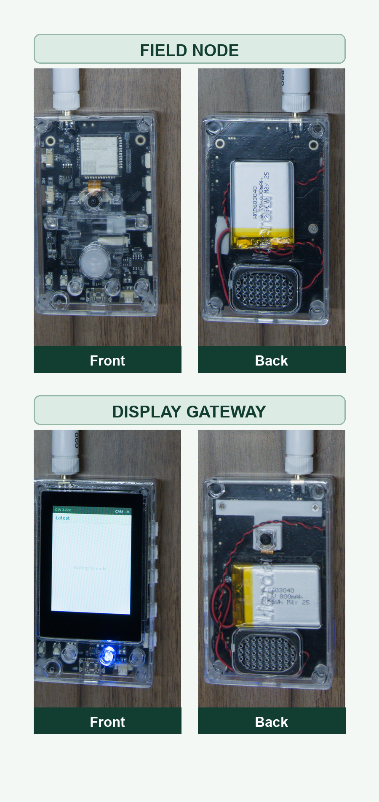

# AM36-WildCam

Language: [中文](README.MD) | English

AM36-WildCam is an open-source long-range wireless imaging demonstration built on the Lierda AM36 ESP32-S3 and LR2021 platform. The same firmware can operate as either a field camera node or a handheld display gateway.

The field node combines a camera, PIR motion sensor, microphone, and LR2021 radio. The gateway provides an LCD, touch controls, physical buttons, link information, and an HTTP image gallery. A node can be mounted on a tree, fence, farm, woodland site, equipment enclosure, or outdoor entrance and then triggered remotely or automatically.



## Table of Contents

- [Features](#features)
- [Hardware Platform and Roles](#hardware-platform-and-roles)
- [External Accessories and PIR Wiring](#external-accessories-and-pir-wiring)
- [Documentation](#documentation)
- [Requirements](#requirements)
- [Build and Flash](#build-and-flash-with-vs-code)
- [Buttons and Role Switching](#buttons-and-role-switching)
- [Touch Controls](#touch-controls)
- [Basic Use](#basic-use)
- [Demonstration Network Security](#demonstration-network-security)
- [3D-Printable Parts](#3d-printable-parts)
- [Repository Structure](#repository-structure)
- [License](#license)

## Features

- Manual remote capture from the gateway.
- Timer, PIR motion, and sound-triggered capture on the field node.
- LR2021 FLRC image transfer with packet-loss detection and retransmission.
- LoRa long-preamble wake-up before FLRC transfer in low-power mode.
- Optional pre-capture audio clip and local voice alarm.
- Gateway LCD pages for images, settings, reception progress, and link status.
- Touch operation with taps and left/right swipes.
- HTTP gallery for viewing and downloading received images and audio.
- Persistent gateway/node role selection using the same firmware image.


## Hardware Platform and Roles

The project uses the **Lierda L-LRMAM36-FANN4-DK01 development kit**. The gateway and field node each use one identical kit and the same firmware. The AM312 PIR sensor module is purchased separately.

<p align="center">
  <a href="https://item.taobao.com/item.htm?id=1074290287510"></a><br>
  <sub>Lierda L-LRMAM36-FANN4-DK01 development kit (click the image to open the purchase page)</sub>
</p>

| Role | Kit and external accessory | Purpose |
| --- | --- | --- |
| Field camera node | [Lierda L-LRMAM36-FANN4-DK01 development kit](https://item.taobao.com/item.htm?id=1074290287510) (https://item.taobao.com/item.htm?id=1074290287510) + [AM312 PIR sensor module](https://e.tb.cn/h.8QmQiC5bW3w6Jr4?tk=MG18TXmjFKS) (https://e.tb.cn/h.8QmQiC5bW3w6Jr4?tk=MG18TXmjFKS) | Captures images and optional audio, then transfers the result to the gateway. |
| Display gateway | [Lierda L-LRMAM36-FANN4-DK01 development kit](https://item.taobao.com/item.htm?id=1074290287510) (https://item.taobao.com/item.htm?id=1074290287510) | Controls the node, receives and displays images, reports link status, and hosts the HTTP gallery. |

Except for the separately purchased AM312 PIR sensor module, the other required hardware is supplied as part of the DK01 development kit and is not listed separately. The purchase links point to Taobao items supplied by the hardware vendor. Availability, package contents, pricing, and product information are subject to the sales pages.

## External Accessories and PIR Wiring

The field camera node requires an external AM312 miniature pyroelectric infrared module for PIR motion-triggered capture.

| External accessory | Purpose | Purchase link |
| --- | --- | --- |
| AM312 miniature PIR motion sensor module | Detects changes in infrared radiation caused by a moving person or animal and triggers capture on the field node | [Taobao: AM312 miniature PIR motion sensor module](https://e.tb.cn/h.8QmQiC5bW3w6Jr4?tk=MG18TXmjFKS) (https://e.tb.cn/h.8QmQiC5bW3w6Jr4?tk=MG18TXmjFKS) |

Disconnect power before wiring. Use the board's 3.3 V supply where possible:

| AM312 pin | Connect to L-LRMAM36-FANN4-DK01 | Notes |
| --- | --- | --- |
| `VCC` | `3V3` | A 3.3 V supply is recommended so that no signal above 3.3 V is presented to the ESP32-S3. |
| `OUT` | `GPIO12` | The firmware configures this pin as a pulled-down input with an active-high trigger. |
| `GND` | `GND` | The AM312 and development board must share ground. |

The PIR input is intended for **field-node mode only**. In gateway mode, `GPIO12` is also assigned to the touch-panel interrupt, so do not share the pin between the AM312 and the touch interrupt while operating as a gateway. Use the DK01 silkscreen and hardware documentation to identify the physical header or pad.

The AM312 is a passive infrared sensor. It detects changes in infrared radiation within its field of view rather than continuously determining whether a person is present. Arrange the installation so that a target moves across the field of view, and avoid pointing the lens at direct sunlight, hot-air outlets, or rapidly changing heat sources. Typical AM312 modules specify an approximate 3–5 m detection range and a field of view up to about 100°. Actual performance depends on mounting height, ambient temperature, the enclosure window, and movement direction.

The firmware arms `GPIO12` about 5 seconds after startup. A high output from the AM312 raises a PIR event immediately; after a trigger, the firmware waits 15 seconds before re-arming, and PIR and sound triggering share the capture cooldown. In low-power mode, the active-high signal can also wake the field node and start capture and upload. Enable `PIR Motion` on the gateway Settings page before use; the setting is sent to the field node and stored in NVS.

## Documentation

- [English Feature Guide](docs/guides/AM36_WildCam_Feature_Guide.pdf)
- [Chinese Feature Guide](docs/guides/AM36_WildCam_Feature_Guide_ZH.pdf)
- [DK01 development kit schematic](docs/hardware/schematic/L-LRMAM36-FANN4-DK01_SCH.pdf)
- [DK01 development kit PCB source](docs/hardware/pcb/L-LRMAM36-FANN4-DK01_PCB.PcbDoc)
- [3D-printable parts directory](docs/3d-print/README.md) — contains seven STEP structural model files.

## Requirements

- Two Lierda L-LRMAM36-FANN4-DK01 development kits are recommended: one gateway and one field node.
- An external AM312 PIR module is required for human/animal motion-triggered capture.
- USB data cables and the required USB-to-serial driver.
- [ESP-IDF](https://github.com/espressif/esp-idf) v5.5.3 is required.
- Python and build tools installed by the ESP-IDF installer.
- Internet access for ESP-IDF Component Manager dependencies.

The project targets `esp32s3`, uses an 8 MB flash configuration, and uses `partitions.csv`. The component manifest currently obtains `lierda-iot/esp_lora_driver` version `0.0.7` from the Espressif staging registry.

## Build and Flash with VS Code

1. Clone the repository and open its root folder in Visual Studio Code.
2. Install the official Espressif ESP-IDF extension from the VS Code Marketplace.
3. Select an installed ESP-IDF v5.5.3 setup when the extension asks for one. This machine-specific path is intentionally not stored in the repository.
4. Click the ESP-IDF **Build** icon in the status bar.
5. Connect the board, select its serial port in the ESP-IDF status bar, and click **Flash**. Use **Monitor** to view serial output.

The ESP-IDF project setup is supplied by the checked-in CMake files, `sdkconfig`, and `sdkconfig.defaults`. Machine-specific VS Code paths and serial-port settings are intentionally excluded.

## Build and Flash from a Terminal

Open an ESP-IDF v5.5.3 terminal in the project directory.

The checked-in `sdkconfig.defaults` preserves the required ESP32-S3 target, 240 MHz CPU setting, 8 MB DIO flash configuration, custom partition table, Octal PSRAM configuration, and release-oriented compiler optimization when `sdkconfig` is regenerated.

```console
idf.py set-target esp32s3
idf.py build
```

Flash the firmware and open the serial monitor. Replace `COMx` with the board's serial port.

```console
idf.py -p COMx flash monitor
```

Press `Ctrl+]` to exit the monitor. Repeat the flash step for the second board. Both boards use the same firmware image; their roles are selected on the device.

If the project was previously configured with another ESP-IDF version or target, clean the generated configuration before rebuilding:

```console
idf.py fullclean
idf.py set-target esp32s3
idf.py build
```

## Buttons and Role Switching

The physical buttons are labeled `K1` through `K5` from top to bottom on the development board. The selected role is stored in NVS and remains active after a restart.

| Current role | Control | Action |
| --- | --- | --- |
| Gateway | Short press `K1` | Open the image page. |
| Gateway | Press and hold `K1` for at least 1.5 seconds, then release | Save the field-node role and restart as a field camera node. |
| Gateway | Short press `K2` | Open the Settings page. |
| Gateway (battery powered) | Press and hold `K3` | Turn the device power on or off. |
| Gateway | Press `K4` | Open the FLRC link-status page. |
| Gateway | Press `K5` | Start a remote capture immediately. |
| Field node | Short press `K2` | Save the gateway role and restart as a display gateway. |
| Field node (battery powered) | Press and hold `K3` | Turn the device power on or off. |

A board with no saved role starts in field-node mode. To prepare a two-device setup, leave one board as the node and short-press `K2` on the other board to make it the gateway.

## Touch Controls

The display gateway provides separate touch controls:

| Gesture | Action |
| --- | --- |
| Tap a control | Activate the displayed control. |
| Swipe left or right | Navigate between supported pages or swipe-enabled controls. |

## Basic Use

1. Flash the same firmware to two AM36 development kits.
2. Configure one board as the display gateway and leave the other as the field camera node.
3. Mount the node at the observation point and aim the camera at the target area. Keep the PIR sensor and microphone exposed if those triggers will be used.
4. Keep the gateway within LR2021 radio range and use the Settings page to configure PIR, sound, timer, audio clip, voice alarm, frequency, and low-power behavior.
5. Start a manual capture with the on-screen `CAPTURE` control or gateway button `K5`. The node captures an image and returns it over FLRC.
6. Use gateway button `K4` to open link status, short-press `K2` to open Settings, and short-press `K1` to open the image page. When battery powered, press and hold `K3` to turn device power on or off.
7. Tap on-screen controls directly or swipe left/right where page navigation is supported.
8. Review the received image, RSSI, transfer rate, packet loss, and transfer time on the gateway.
9. To browse stored results, connect a phone or computer to the Wi-Fi network shown on the gateway Settings page and open `http://192.168.4.1`.

### Demonstration Network Security

The SoftAP is intentionally open (`WIFI_AUTH_OPEN`), and the configuration, gallery, and image endpoints do not require authentication. Use this design only in a controlled demonstration or field environment. It is not suitable for production deployment. Before production use, configure a WPA2/WPA3 password and add authentication and authorization to the HTTP endpoints.

For unattended use, enable timer, PIR, or sound triggering. In low-power mode, the node can remain deployed at a remote observation point; PIR or a gateway LoRa wake-up starts the FLRC transfer path only when work is required.

## 3D-Printable Parts

The [`docs/3d-print/`](docs/3d-print/) directory provides seven STEP structural model files for the AM36-WildCam enclosure, mounting, and related parts.

## Repository Structure

```text
AM36-WildCam/
|-- main/                              Application, BSP, camera, radio, UI, audio, and web code
|-- docs/images/                       Images used by the README files
|-- docs/guides/                       English and Chinese feature guides
|-- docs/3d-print/                     Reserved for 3D-printable structural parts
|-- docs/hardware/schematic/           DK01 development kit schematic
|-- docs/hardware/pcb/                 DK01 development kit PCB source
|-- CMakeLists.txt                     ESP-IDF project entry
|-- README.MD                          Chinese README (default)
|-- README_EN.md                       English README
|-- version.txt                        Canonical firmware version
|-- CHANGELOG.md                       Release history
|-- sdkconfig.defaults                 Reproducible default configuration
|-- sdkconfig                          Current project configuration
|-- partitions.csv                     Custom flash partition table
|-- dependencies.lock                  Resolved component versions
|-- THIRD_PARTY_NOTICES.md             Third-party source and generated-asset notices
`-- LICENSE                            BSD-3-Clause license
```

## License

AM36-WildCam is distributed under the [BSD-3-Clause license](LICENSE).

Third-party source material and generated assets retain their applicable terms and attribution. See [THIRD_PARTY_NOTICES.md](THIRD_PARTY_NOTICES.md) for details.

## Versioning and Community

The current firmware version is stored in [version.txt](version.txt), embedded in the application image by ESP-IDF, and documented in [CHANGELOG.md](CHANGELOG.md). Releases use Semantic Versioning and `vMAJOR.MINOR.PATCH` Git tags.
